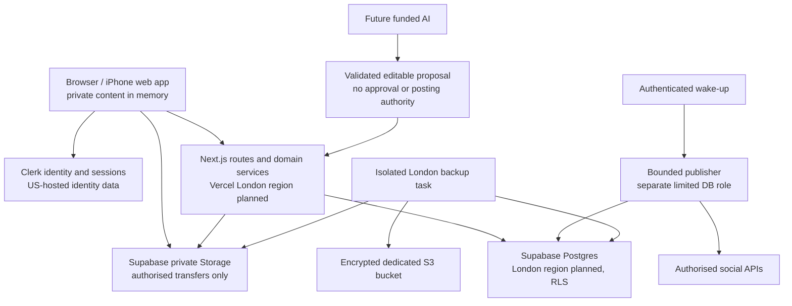

# Cadence privacy architecture and handling rules

Decision record: 5 October 2026. Scope: internal web pilot and its gated delivery path. This is a design contract, not evidence that providers, regions, controls or compliance reviews are configured. The current build status is tracked in [delivery evidence](Cadence-Delivery-Evidence.md).

## Security goals and excluded data

Cadence may hold ordinary personal drafts and expressly authorised client-confidential notes. It must not accept highly sensitive records. User content, personal data, client-confidential notes, credentials and provider payloads are sensitive throughout capture, persistence, derivation, sharing, publication, analytics, support, backup and deletion. Each build step must record the data it admits, authorised actors and purposes, storage, retention, deletion/revocation behavior and negative-test evidence.

Captures and drafts belong to their creator's private scope by default. Workspace owner, administrator, brand membership or social-account permission alone does not grant access. Explicit grants identify the selected recipient, resource version and permitted purpose. A released excerpt is a separate reviewed snapshot. It discloses no original recording, transcript, title, filename or private URL unless those fields were separately reviewed and included. Revocation blocks future access, derivative reads, AI inputs and eligible unsent work; it cannot retract information already viewed or published to an external network. Orphan recovery is an audited command with fresh authentication, reason and explicit custodian.

## System and identity boundaries

The chosen web stack is strict TypeScript, Next.js App Router, Vercel, Clerk and Supabase Postgres/private Storage. Use Clerk's supported Supabase third-party integration to verify tokens; map the immutable Clerk subject string to a unique internal user UUID. Do not create Supabase Auth identities or use editable Clerk metadata as a source of roles or grants. Read memberships, grants, entitlements and current policy from live protected database state.

Clerk identity data is US-hosted. Keep all captures, notes, client data, social credentials and user-generated content out of Clerk metadata. Record actual identity/authentication, hosting, storage, backup and social-provider flows; review processor terms and applicable international-transfer arrangements before live pilot use. Planned London region selection is a preference, not proof that every control-plane, support, CDN or subprocess flow remains in the UK.

Build TOTP MFA and backup-code recovery during the identity step. A protected database configuration chooses `closed_pilot` or `mfa_required`; missing, unrecognised or inconsistent policy fails closed. `closed_pilot` permits only two designated Clerk subjects and the designated FSS pilot workspace. It is a closed-pilot exception, not a default or a public-user option. Test both policy modes. Public onboarding is blocked until required second-factor claims are enforced consistently by application APIs, database access and Storage. Sharing, recovery, account changes, approvals, scheduling, export and deletion also require an active session and authentication no older than ten minutes.

Keep a stable internal UUID for foreign keys and a unique `clerk_user_id TEXT` for identity mapping. Soft/deletion tombstones and idempotent, signed webhook handling prevent a delayed create/update event from restoring a deleted identity. Verify webhook signatures, timestamps, event IDs and replay behavior before acting.

## Access and data lifecycle

| Data/use | Admitted data and permitted actors | Storage and safeguards | Revocation, deletion and evidence |
| --- | --- | --- | --- |
| Identity | Verified Clerk subject, email verification and session/MFA claims; identity service and scoped authentication code | Clerk identity service; internal subject mapping and live roles in protected Postgres | Signed deletion lifecycle; no content in identity metadata; stale sessions and deleted-user resurrection denied |
| Private capture/draft | Ordinary personal or authorised client-confidential material; creator and individually granted recipients for stated purpose | Server database and private object keys; source, revision, owner, category, purpose, access version and lifecycle state | Explicit grant revocation blocks future reads/derivatives; deletion covers revisions, indexes and derivatives; creator/admin cross-access negative tests |
| Reviewed excerpt | Only selected, reviewed fields; explicitly named recipient and purpose | Separate immutable snapshot with source-version lineage; no reference that fetches original private fields implicitly | Revoke snapshot access and eligible dependent work; test original title/transcript/file/path do not leak |
| Media | Bounded upload bytes; authorised transfer actor and purpose | Private quarantine; actual type/size/checksum inspection; immutable keys; separately reviewed, redacted and metadata-stripped derivative objects | Delete original and restricted descendants; verify object absence and denied cached/access paths |
| Social credential | Provider token material needed for an authorised account | Server-only encrypted storage, authenticated encryption and key version; key access separated from ordinary app data | Reconnect/revoke/provider expiry; rotation test; no client, analytics, log, backup URL or AI access |
| Approval/publication | Exact public revision, destination, account and approval state | Immutable public snapshot, separate approval hash, transactional job state and append-only minimal audit | Current permission/approval checked before dispatch; edits require approval again; unknown provider outcome reconciled before another create |
| Analytics/AI proposal | Explicitly permitted inputs only; authorised purpose, feature release and plan/quota | Deterministic facts or future provider; validated proposal separated from source and public revision | Source revocation invalidates derived cache/proposal and unsent dependent work; production inference disabled until funded/released |
| Logs/support | Allow-listed operational metadata and correlation IDs only | Restricted operational logging; no request bodies/content, email addresses, cookies, tokens, invites or signed URLs | 30-day operational log default; scan fixtures for secret markers and content leakage |

Sensitive writes run through thin validated route handlers and focused domain services. Direct client writes are restricted to explicitly authorised operations. RLS applies to user-scoped Postgres/Storage access. For privileged commands, use a restricted server database role without `BYPASSRLS`; set a verified actor/workspace context transaction-locally using parameterised calls, and clear it automatically on transaction end. Revoke public/default execution on private mutation functions. Test pooled-connection reuse and every direct REST, Storage, RPC and server path for an access bypass.

Use optimistic versions, idempotency keys and separate content/approval hashes. Approval binds the exact immutable revision, destination and canonical public payload. Scheduling creates durable work atomically; the worker checks current member/provider permission, approval, cancellation and lateness immediately before dispatch. No database transaction stays open over a provider request. A lost create response is `outcome_unknown`; reconciliation must occur before retrying.

## Browser, file and telemetry rules

- Private page/API responses use `Cache-Control: no-store`; do not persist private payloads in local/session storage, IndexedDB, Cache API, service workers, shared server caches or analytics replay.
- Keep editing content in memory and use authorised server autosave. Preserve dirty content and report conflict/save errors without logging its contents.
- Upload to quarantine and verify actual bytes, MIME, dimensions, size and integrity before an asset becomes ready. Never let a client declaration mark media ready.
- Use immutable object keys. Crops, redactions, transcoded media and metadata removal produce distinct reviewed objects with inherited or stricter permissions.
- Prefer authenticated private previews. If a time-limited download capability is unavoidable, document its lifetime and explain that expiry cannot revoke a copy already downloaded.
- Logs accept allow-listed categories, safe identifiers and correlation IDs. Never record content, email, cookies, authorization headers, invitation values, OAuth state, tokens, key material, raw provider errors or signed URLs.
- Preview and CI environments use synthetic data and separate test credentials. A preview has no production social grants and cannot run the production publisher. This remains mandatory until step 1.8 passes.

## Retention, erasure and recovery

Pilot defaults below are maximums unless a provider's permitted use or contract requires earlier expiry. Build deletion as an observable state machine, not a best-effort cascade. Keep the minimum independent erasure ledger needed to replay deletion into restored copies; do not put erased content or original identifiers into that ledger.

| Record | Pilot default | Completion evidence |
| --- | --- | --- |
| Operational logs | 30 days | Scheduled expiry and a log-retention check |
| Minimal audit record | 180 days | No source/post body or credentials; documented expiry and legal-hold decision path |
| Independent backup snapshots | 30 days | Expiration of encrypted DB/media manifests and objects |
| Abandoned uploads and exports | 24 hours | Object and temporary capability are no longer usable |
| Active-data erasure | Within 24 hours | DB, source versions, search entries, media, thumbnails, derivatives, exports and eligible provider-side data are accounted for |
| Provider-derived records | Shorter of the allowed purpose/expiry and contract | Provenance and expiry review; restricted rows and caches removed |

Use one isolated backup task in the selected London region and a dedicated London S3 bucket. Encrypt database, private media and required key-dependency backups before storage. Separate backup-write, expiry and restore privileges. Only the isolated task writes snapshots; its permissions are narrowly scoped. A snapshot is not successful until a complete manifest, row/object counts, checksums and key dependencies are verified and a success marker is published. Database backups alone exclude Supabase Storage objects.

Protect restore/decryption keys separately from the backup writer. A restored environment remains inaccessible and publishing stays paused while operators verify the manifest, recover DB/media/key dependencies, replay the independent deletion ledger, validate tenant/access invariants, and reconcile external publication outcomes. Restoration must not resend completed or uncertain posts. The proposed targets are RPO 24 hours and RTO four hours; treat them as unproven until a timed disposable-environment restoration passes.

## Per-step privacy acceptance

The numbered sequence and exact delivery-gate procedure are recorded in the [implementation plan](plans/2026-10-05-cadence.md). Each PR must attach evidence for its row, including negative tests, before the next step starts.

| Step | User-data control that must pass before the step closes |
| --- | --- |
| 0.1 | Preserve docs/research; do not commit local secrets; secret-scan history; isolated preview/test credentials; publishing disabled. |
| 0.2 | Tenant-consistent relations; RLS and grants; server roles; pooled actor-context reset; direct API/Storage/RPC and cross-tenant denials. |
| 0.3 | Implement the Stitch S02 shell as synthetic-only UI; private/shared states; keyboard, responsive, contrast and denial-recovery checks. S03 remains the reference for the later capture gate. |
| 1.1 | Verified identity and exact pilot allowlist; session freshness; webhook replay/deletion; both MFA modes. |
| 1.2 | No client self-grant/escalation; membership removal and concurrent seat/account limits; protect last owner and audit. |
| 1.3 | Capturer-only read until explicit grant; excerpt-field allowlist; separate audited recovery; revoke invalidates descendants; erase lineage. |
| 1.4 | Quarantine and integrity; authorised previews; immutable assets; derivative inheritance; physical object/cache deletion. |
| 1.5 | Version conflict preserves draft; only readable sources accepted; exact payload approval; edits require fresh approval. |
| 1.6 | Destination export is approval-scoped; no hidden source metadata; DST tests; accepted reminder/schedule/publication states distinct. |
| 1.7 | No inference or production work until funded release; source/purpose/plan/quota denial; fixture executor cannot be wired in production. |
| 1.8 | Export/erasure completion evidence; original/derivative purge; full DB/media/key restore; deletion-ledger replay; safe logs and processor record. |
| 2.1 | Worker least privilege and authenticated wake-up; live permission checks; claim/race/revocation and uncertain outcome tests. |
| 2.2 | OAuth state bound once to actor/workspace/provider; encrypted credentials; callback replay/account substitution and rotation denial. |
| 2.3 | LinkedIn grant/account/format independently verified; exact approved payload only; sanitised failure; manual fallback. |
| 2.4 | Facebook Page/account scopes independently verified; restricted media, revocation and evidence cases. |
| 2.5 | Instagram eligible account/format and processing lifecycle; unsupported content remains blocked. |
| 2.6 | Redacted logs/alerts; pause/reconcile runbooks; restore cannot duplicate external effects. |
| 3.1 | Analytics read permission distinct from collection; provenance/expiry; missing values preserved; revoke invalidates all derived caches. |
| 3.2 | Four internal cycles reviewed for privacy/data loss/publishing incidents; each fix follows its own merged-PR gate. |
| 5.1 | MFA required on every API/Storage/data path; exception removed; enrolment, recovery and backup codes tested. |
| 5.2 | Independent isolation review; abuse/retention/capacity checks; truthful public capability/privacy claims and support path. |

## Current readiness boundary

The step 0.3 web shell follows Stitch S02 and is a synthetic-only interface. Stitch S03 is reserved for the later private-capture implementation. The shell has no authentication, connected identity tenant, live content, persistent browser storage, analytics or service worker. Pages are rendered dynamically with `Cache-Control: private, no-store` and are marked no-index. The access-denied route and visibility labels demonstrate intended states; they are not substitutes for server authorization, which must be implemented and tested in the later identity and content steps. See the [Stitch design implementation record](Cadence-Design-Implementation.md).

No live identity tenant, application database, storage bucket, backup task, social account or production cloud environment is configured. Do not enter real information before step 1.8 closes. Before the pilot, recheck provider terms, processor/subprocessor locations, actual regional settings and access logs; confirm email, export/erasure, backup restoration and incident ownership. Do not state that a control, certification or legal compliance exists until evidence supports the claim.
