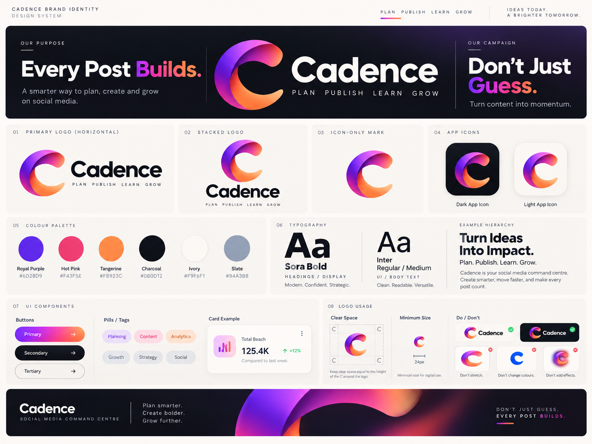

# Cadence — recovered product and brand planning

Recovered on 4 October 2026 from the existing ChatGPT conversations below. This is a reference summary of prior work, not a new specification or evidence that the app has been built. Original technical recommendations and estimates remain proposals from September 2026.

## Original conversations

| Conversation | Project | Date | What it contains |
| --- | --- | --- | --- |
| [Competitor Research Summary](https://chatgpt.com/c/6a9ecf30-e980-83eb-a520-16f338cb2870) | FSS CTO | 7–8 September 2026 | Internal-first product concept, competitor research, differentiation, AI proposals, technical direction, milestones, and a link to the generated UI/UX brief. |
| [Name And Brand Direction](https://chatgpt.com/c/6aa04ca0-e544-83eb-be5e-34ecdd000553) | Branding | 8 September 2026 | Selected logo variation, tagline discussion, and the user's final tagline/campaign choice. |
| [Create Stitch Prompt](https://chatgpt.com/c/6aa07de1-7ba8-83eb-936d-b2b020b9f865) | UI/UX Designer | 8 September 2026 | Cadence product workflow, navigation, five journeys, fourteen screen families, visual rules, interaction rules, and the design-system image. |

## Product intent and initial scope

Cadence is an intentional social media command centre. Its purpose is to turn genuine experience and expertise into useful content, coordinate that content across brands, and learn from the results.

- **Initial use:** an internal tool for FSS, Jean, and his wife, as clarified by the user on 4 October 2026.
- **Initial brands in the recovered plan:** Jean's personal brand, Faithful Software Solutions, and NexSteps within one workspace.
- **Later ambition:** release it publicly once the internal tool is good and the audience has grown. The earlier research recommends also proving repeatable value with independent users before commercial release.
- **Brand principle:** every post should have purpose, matter, and build on what came before, rather than being an isolated attempt to please the algorithm.
- **Proposed pilot:** LinkedIn first, plus an Instagram short-video/trial example. These are design scenarios, not confirmed integrations.
- **Outside the first pilot:** billing, agency portals, universal platform support, social listening, and full video editing.

The core loop is:

```text
Capture real material
  → Choose purpose and audience
  → Create brand-specific content
  → Review evidence and approve an exact revision
  → Schedule or publish through a supported route
  → Review results
  → Record a learning
  → Create the next useful piece
```

The application should help answer: What should I work on next? Why does it matter? What is ready? What needs checking? What did we learn?

## Brand decisions and recovered visual direction

The user selected **Variation 5** and later confirmed: “Yes Every Post Builds with Don’t Just Guess as a campaign.” Earlier assistant tagline suggestions were superseded by this choice.

- **Name:** Cadence.
- **Primary tagline:** Every Post Builds.
- **Campaign line:** Don’t Just Guess.
- **Supporting language on the recovered design board:** Plan. Publish. Learn. Grow.
- **Selected identity:** a dimensional gradient C, a contrasting wordmark, and a confident visual style.
- **Requested brand deliverables:** individual logos, app icons, then a design system.

The recovered design board shows horizontal and stacked logos, an icon-only C, dark/light app-icon treatments, palette, typography, component examples, and logo-usage guidance.



| Colour | Value |
| --- | --- |
| Royal Purple | `#6D28D9` |
| Hot Pink | `#F43F5E` |
| Tangerine | `#FB923C` |
| Charcoal | `#0B0D12` |
| Ivory | `#F9F6F1` |
| Slate | `#94A3B8` |

Typography: **Sora Bold** for headings/display; **Inter Regular/Medium** for body and interface text. The application direction is dark first, using charcoal/ivory and restrained purple–pink–orange accents. The UI prompt calls for contrast testing rather than treating the board's examples as validated accessible controls.

## Planned capabilities and screen families

| ID | Screen family | Recovered scope |
| --- | --- | --- |
| S01 | Setup | Resumable brand, audience, and voice setup; optional account connection; drafting without payment or invitations. |
| S02 | Today | Publishing issues, reviews, upcoming posts, reasoned next actions, and recent learning. |
| S03 | Capture | Text, voice, documents, images/video, and pasted transcripts; visibility controls and upload/transcription states. |
| S04 | Library/source detail | Search, source material, editable transcripts/excerpts, permitted use, derived drafts, and usage. |
| S05 | Brand playbook | Audience, outcomes, content pillars, voice examples, prohibited claims, assets, and platforms. |
| S06 | Composer | Brand/platform variants, sources, previews, revision/save state, accessibility fields, carousel outlines, and video briefs. |
| S07 | Review | Review queue, evidence, comments, requested changes, and approval of a specific revision. |
| S08 | Calendar | Week/list views first, month secondary, unscheduled content, series progression, and explicit time zone. |
| S09 | Publication detail | Per-account status, approved revision, scheduling details, safe recovery, and manual publishing fallback. |
| S10 | Performance | Defined metrics, comparable-post evidence, data freshness, and separate reach/engagement/business outcomes. |
| S11 | Experiments | Hypothesis, variants, context, metric, observation window, results, and learning; inconclusive results supported. |
| S12 | Weekly learning | Evidence-linked observations, limitations, and suggested next tests; amend/reject learning. |
| S13 | Accounts/permissions/privacy | Connection health, supported capabilities, people/permissions, source sharing, deletion, and AI preferences. |
| S14 | Mobile adaptations | Today, capture, playback/transcript, review, calendar agenda, and publication recovery. |

Desktop navigation: **Today / Library / Create / Review / Calendar / Learn / Settings**. Mobile navigation: **Today / Capture / Review / Calendar**, with a labelled More menu.

The five proposed prototype journeys are:

1. Voice note → transcript → evidence-backed draft → review → approved scheduled post.
2. One authorised source → distinct treatments for different brands, with independent review and source permissions.
3. Mobile approval of an exact revision, including recovery when the draft has changed.
4. Comparable results → documented observation → next experiment and linked draft.
5. Publishing problem → account-specific recovery or a clearly labelled manual route.

## Differentiation and AI proposals from the research

The research compared Buffer, Metricool, Hootsuite, Sprout Social, Planable, Later, Blaze, SocialBee, Taplio, Typefully, Agorapulse, Blotato, and Postiz, with additional references to FeedHive, Predis.ai, and OpusClip. It was desk research checked on 7 September 2026, not hands-on testing. This summary does not revalidate current competitor capabilities or pricing.

The proposed differentiation combines:

- **Genuine expertise capture:** create from real work, voice notes, case studies, and approved evidence.
- **Documented learning:** retain the source, editorial choices, hypothesis, results, and next test.
- **Founder/company coordination:** keep the personal brand, FSS, and NexSteps connected while giving each a distinct purpose and voice.
- **Meaningful outcomes:** distinguish tracked enquiries, demos, subscribers, conversations, self-reported sources, and unattributed outcomes.

Proposed AI roles: expertise interviewer, brand-aware editor, campaign planner, repurposing assistant, performance analyst, and audience-question organiser. These are proposals, not implemented functionality.

The control model is consistent across the recovered plan:

- AI offers editable suggestions rather than silently overwriting or publishing.
- Suggestions link to source evidence; unsupported claims are flagged.
- Approval is revision- and destination-specific. Public-facing edits require renewed approval.
- Approval and publishing are separate capabilities/actions.
- Private sources are not silently shared between brands.
- Metrics are calculated in application code or SQL; AI explains the results and limitations.
- Comparisons use the same platform, similar format, and equivalent post age; paid and organic results remain separate.
- Unknown publishing outcomes are reconciled before a retry; manual publication is labelled honestly.
- Scheduling uses explicit date/time/account/revision and Europe/London by default.

## Original technical proposals and delivery sequence

These were recommendations in the research conversation, not final implementation decisions.

- **Stack:** Next.js + TypeScript, a small Node/NestJS service, Postgres, and Prisma; one modular application with a separate background worker.
- **Alternatives:** evaluate Postiz as a publishing foundation after licence/security review, or put the custom intelligence/review interface over an existing scheduler.
- **Cloud:** AWS London; lean hosting, encrypted managed Postgres, S3, a queue, Terraform, and separate development/staging/production.
- **Historical infrastructure allowances:** approximately £100–250/month for a small internal pilot; £400–1,200/month around 50 modest-use customer workspaces. These September planning figures exclude development, tax, publishing subscriptions, and AI/media usage and have not been updated here.
- **Boundaries:** AI proposes content; authenticated application code controls permissions and state; the publishing worker sends approved revisions. External AI clients do not receive social access tokens.
- **Core entities:** Workspace, Brand, Campaign, ContentItem, Revision, Publication, Source, Approval, MetricSnapshot, Experiment, and Outcome. Publication destinations are social accounts.
- **API:** REST, with separate drafting/approval/scheduling operations; tightly scoped MCP tools for Claude/Codex were proposed.
- **Structure:** `apps/web`, `apps/api`, `apps/worker`, `packages/domain`, `packages/connectors`, `packages/ai`, `infra`, `scripts`, and `.github`.
- **Security:** managed authentication, privileged-user MFA, workspace/brand permissions, encrypted tokens, least privilege, audit records, and deletion/retention for sources and AI-derived memory.
- **Verification priorities:** cross-brand isolation, approval invalidation, duplicate-post prevention, revoked tokens, correct metrics, and AI evaluations for unsupported claims or brand confusion.
- **Operations:** publishing success, queue delay, stale analytics, AI cost, draft acceptance, restoration testing, and runbooks for expired permissions, missing/duplicate posts, and unsafe AI output.

The original milestones were:

1. Establish a baseline against existing tools: time, edits, gaps, and cost.
2. Build the internal content loop: capture, brand context, evidence-backed drafts, review, and one reliable publishing route.
3. Add the learning loop: comparable metrics, campaign links, outcome records, and experiments.
4. Test with approximately 5–10 independent founders/small teams and validate a paid pilot before wider release.

Internal success measures: time per approved post, rewriting required, planned content actually published, and relevant enquiries/conversations. Improvement targets were to follow baseline measurement.

## Recovered assets and limits

- `CadenceDesignSystem.png` is copied unchanged from the attachment returned by the original UI/UX conversation.
- The original chats reference `Cadence_UI_UX_Designer_Brief.md`, a plain-text companion, and `Cadence_Google_Stitch_Prompt.md`/`.txt`. Their generated download files were not returned by the chat reader; this document does not claim to reproduce those full originals.
- Parts of the long research response and Stitch prompt were truncated by the chat reader. This summary contains only recovered information, plus the user's explicit 4 October clarification about the initial users.
- Standalone original Variation 5 artwork, production vector logos, and separate app-icon files were not recovered. The board is a visual reference, not proof of production-ready logo assets.
- The saved `cadence_app` project directory was empty when checked on 4 October 2026. The recovered material establishes product/brand planning, not an existing implementation.
